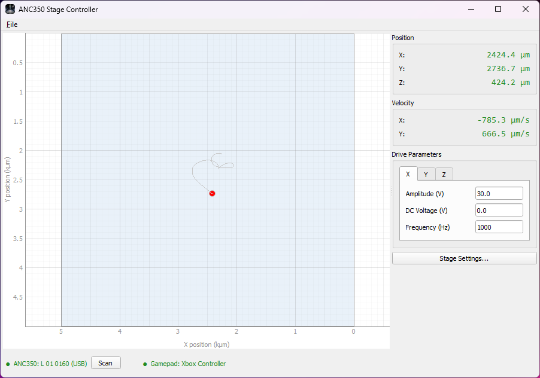
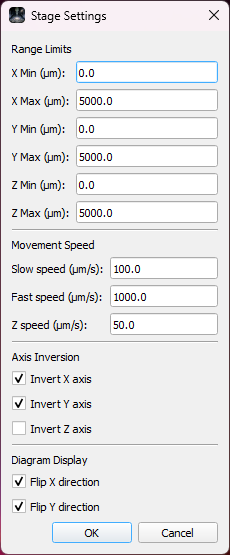

# ANC350 Controller

GUI application for controlling attocube ANC350 nanopositioners with an Xbox-compatible gamepad. Tested with ANC350 hardware and a Gamesir Xbox-compatible gamepad.

## Features

- **Closed-loop positioning** — X and Y axes are controlled via analog stick; Z axis via long-press of A/B. The stage automatically tracks a virtual target position.
- **Analog stick input** — XY movement speed is proportional to stick deflection, giving precise, intuitive control.
- **Dual-speed XY** — hold the left trigger to switch between slow and fast movement speeds.
- **Single-step mode** — D-pad (X/Y) and short A/B press (Z) trigger discrete steps for fine positioning. The app reads back the actual position from the device after each step.
- **Independent axes** — XY and Z operate independently. A Z single-step does not pause XY movement, and vice versa.
- Real-time position display with XY diagram and per-axis velocity readout.
- Per-axis amplitude, frequency, and DC voltage control.
- Configurable range limits, axis inversion, and diagram flip.
- All settings persist across sessions.

<p align="center">
  
  
</p>

## Prerequisites

- **Operating system:** Windows. The ANC350 driver also supports Linux (see [attocube-systems/ANC350_Python_Control](https://github.com/attocube-systems/ANC350_Python_Control)); Linux support may be added in a future release.
- **Gamepad:** Xbox-compatible (XInput). PlayStation and Nintendo Switch controllers require a wrapper such as [DS4Windows](https://ds4-windows.com/) or Steam Input.
- **If running from source:** Python 3.8+ and the packages listed in the [Installation](#installation) section.
- **Driver DLLs:** `anc350v4.dll` v1.2.0 (MIT) and `libusb0.dll` v1.2.5.0 (LGPL v2.1) are bundled inside the pre-built executable. Third-party licenses are in the [`licenses/`](licenses/) directory.

## Installation

Download the latest `ANC350_Controller.exe` from the [Releases](https://github.com/Lewbert/anc350-controller/releases) page. No installation required — just run the executable.

<details>
<summary>Running or building from source</summary>

**Run from source:**
```bash
pip install pyqt5 pyqtgraph
python -m app.main
```

**Build a standalone executable:**
```bash
pip install pyqt5 pyqtgraph pyinstaller pillow
pyinstaller ANC350_Controller.spec
```
The executable will be in `dist/`.
</details>

## Gamepad Controls

### XY axes (left stick / D-pad)

| Control | Action |
|---|---|
| **Left stick** | Move X/Y continuously in closed-loop mode. Speed varies with stick deflection. |
| **Left trigger** (hold) | Switch to fast speed while held. |
| **D-pad** | Single-step X/Y. Exits closed-loop and reads back the actual position. |

### Z axis (A / B buttons)

| Control | Action |
|---|---|
| **A** short press | Z forward single step — exits Z closed-loop. |
| **A** long press | Z forward closed-loop continuous movement at the configured Z speed. |
| **B** short press | Z backward single step — exits Z closed-loop. |
| **B** long press | Z backward closed-loop continuous movement at the configured Z speed. |

### Global

| Control | Action |
|---|---|
| **Start** | Toggle all axes on/off. |

**Step mode:** After a D-pad or short A/B press, the affected axis enters step mode — the virtual target pauses while the app reads back the actual position. XY resumes when you move the left stick; Z resumes on the next long press of A or B. XY and Z step modes are independent.

## Usage

1. Connect the ANC350 controller via USB.
2. Connect your gamepad.
3. Launch the app — it will auto-detect the ANC350 device.
4. All axes are enabled on startup. Press **Start** to toggle them on/off.
5. Adjust drive parameters (amplitude, frequency, DC voltage) per axis in the **Drive Parameters** panel.
6. Configure range limits, speeds (XY slow/fast, Z), and axis inversion via the **Settings** button or **File → Stage Settings**.

---

`anc350v4.dll` v1.2.0 from [attocube-systems/ANC350_Python_Control](https://github.com/attocube-systems/ANC350_Python_Control), used under MIT license.
`libusb0.dll` v1.2.5.0 is [libusb-win32](http://libusb-win32.sourceforge.net), used under LGPL v2.1.
Third-party licenses are in the [`licenses/`](licenses/) directory.
